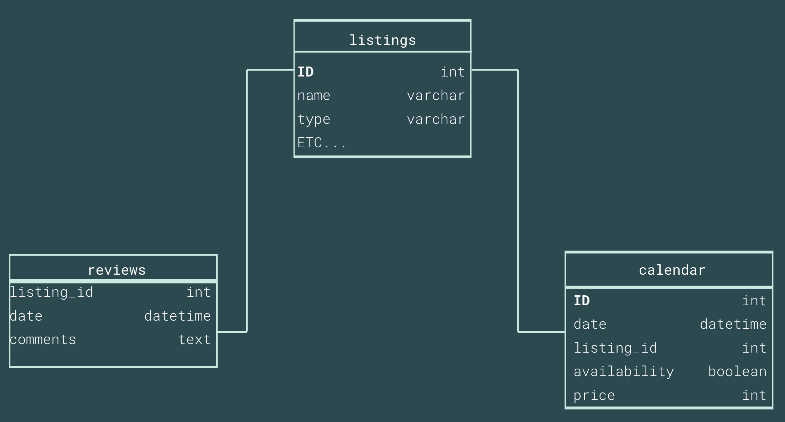

# Airbnb Housing Business Evolution Analysis
*Imogen Mills, Victor Hugo Aizpurua*

*[Data Analytics BootCamp part-time, Ironhack Amsterdam, February 2020]*

## Content
- [Project Description](#project-description)
- [Questions & Hypotheses](#questions-hypotheses)
- [Dataset](#dataset)
- [Database](#database)
- [Workflow](#workflow)
- [Organization](#organization)
- [Links](#links)

## Project Description
For this project we are focusing on Airbnb and their housing service in Amsterdam. Through the analysis of different sets of data we want to give a brief description of the status of their business in our city (and the evolution of this business throught a longitudinal dataset if we decide to include multiple years). We chose this project because Amsterdam has the highest prices and rentings of all the European capitals and theres been an active debate on the impact of Airbnb on the quality of life of residents.

## Questions & Hypotheses
Our main question is: Has Airbnb housing business increased in the last year (or years, to define) or declined?  
- Our Null Hypothesis is that the business has not grown in the last year(s).  
- Our Alternative Hypothesis is that the housing business has indeed increased in the last year(s).  
A second Alternative Hypothesis is that the housing business has decreased in the last year(s).

Other secondary questions we have asked ourselves are:
- Have the new Airbnb city regulations had an impact on host’s listing habits?
- Have ratings changed over the years?

## Dataset
We used dataset from the following sources: Kaggle, Insideairbnb and directly Airbnb.
These datasets contain different information about listings, reviews, neighborhoods, calendars, etc.

For each year we had 5 sets (reviews, reviews_details, listings, listings_details, calendar). The "_details" tables are like their mother table but with more details.

## Database
Our database consists of 11 connected tables. 
We have listings (we chose to work with the table with details, as it is exactly like mother table but with many more columns of information) which is a list of all the available listings in Amsterdam. We have a listings table for each year (listings_2015, listings_2016 and so on). We also have reviews and reviews_details (same case), which include all the reviews for the aforementioned listings (we realized that the latest reviews table has all the reviews for every year). Last, we have calendar that lists all the dates of the year for each listing, and information like availability and price. Same case as for listings, we have a calendar table for each year.

## Workflow
After receiving the subject, Amsterdam, we started by looking for a topic that interested us both. We initially settled on a different topic, namely cycling in Amsterdam. We defined our parameters and came up with a research question. However we were unable to find any suitable data. Back at square one we found a second topic: Airbnb's housing rental service. There had been talk of regulations and we were able to find suitable datasets. We again came up with our research question and set our parameters. We went on to review the data, only using sets that would help us answer our research question. We then built the database. We continued by writing our code and starting work on the presentation. We went on to do our descriptive analysis and to define our findings.

## Organization
We used a Trello board to have a better overview of the tasks that were needed in each stage and to organize ourselves so that when working separated we could work parallelly in different tasks without risk of overwriting our progress and to identify which were the tasks that needed us to work together on.

## Links
[Repository](https://github.com/vaiz-foleon/Project_2_Amsterdam_dataptams2020)  
[Slides](https://slides.com/)  
[Trello](https://trello.com/b/p2i8mqWY/ironhack-project-airbnb)  
